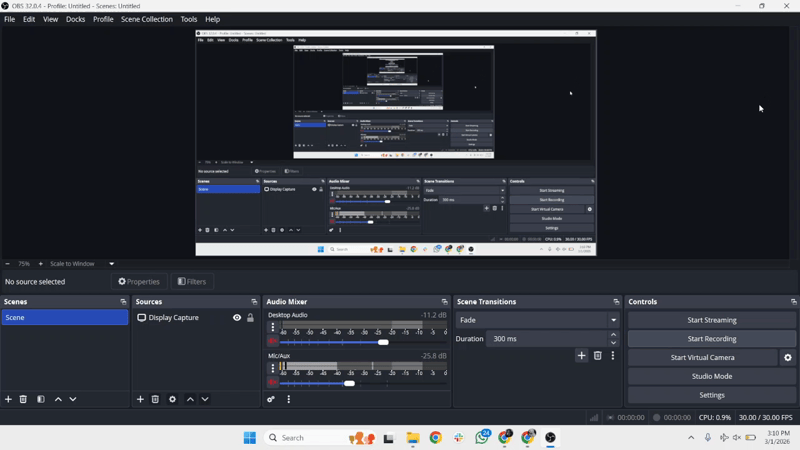

# Baremetal Kubernetes Cluster on AWS

A fully operational, high available Kubernetes cluster provisioned **from scratch** on AWS EC2 using `kubeadm` — no managed services, no shortcuts. This project demonstrates core Site Reliability Engineering (SRE) principles including custom networking, stateful data persistence and rigorous load testing under real-world conditions.

---

## Project Overview

| Property | Detail |
|---|---|
| **Live Domain** | `simplek8s.rall4sre.my.id` |
| **Routing Strategy** | DNS Round Robin across Worker Nodes |
| **Environment** | AWS VPC |
| **Nodes** | 3x EC2 `c7i-flex.large` (1 Control Plane, 2 Worker Nodes) |
| **OS** | Ubuntu 22.04 LTS |
| **Container Runtime** | Containerd |

---

## Tech Stack

| Tool | Role |
|---|---|
|  **Docker** | Container Build & Registry (Docker Hub) |
|  **AWS** | EC2 & VPC |
|  **GitHub** | SCM Repository |
|  **Flask** | App Backend Services |
|  **Redis** | In-memory Database (AOF enabled) |
|  **Kubernetes** | Container Orchestration |
|  **NGINX Ingress** | Edge Routing & Load Balancing |
|  **Calico** | CNI Network Plugin |

---

## Architecture

http://simplek8s.rall4sre.my.id/architecture

OR 

Download: https://github.com/snickerdoodless/simple-k8s-cluster-deployment/blob/main/templates/architecture-diagram.html 

---

## Stress Test & Performance Analysis

Load tests conducted using [hey](https://github.com/rakyll/hey) from an **external network (WSL)** to simulate real-world traffic traversing the full internet path: WSL → DNS resolution → AWS Security Groups → NGINX Ingress → Pod.

### Test: Extreme Load (Breaking Point)
| Metric | Value |
|---|---|
| Total Requests | 50,000 |
| Concurrency | 500 |
| Requests/sec | 177.24 |
| Average Latency | 2,650ms |
| p50 Latency | 1,185ms |
| p90 Latency | 5,978ms |
| p99 Latency | 18,785ms |
| Success Rate | **99.9% (49,952/50,000)** |

```bash
Summary:
  Total:        282.0995 secs
  Slowest:      20.0014 secs
  Fastest:      0.2719 secs
  Average:      2.6500 secs
  Requests/sec: 177.2424

  Total data:   361053056 bytes
  Size/request: 7228 bytes

Response time histogram:
  0.272 [1]     |
  2.245 [31687] |■■■■■■■■■■■■■■■■■■■■■■■■■■■■■■■■■■■■■■■■
  4.218 [9555]  |■■■■■■■■■■■■
  6.191 [4026]  |■■■■■
  8.164 [1770]  |■■
  10.137 [849]  |■
  12.110 [565]  |■
  14.083 [355]  |
  16.055 [320]  |
  18.028 [263]  |
  20.001 [561]  |■


Latency distribution:
  10% in 0.5431 secs
  25% in 0.6921 secs
  50% in 1.1858 secs
  75% in 3.3790 secs
  90% in 5.9783 secs
  95% in 8.9578 secs
  99% in 18.7858 secs

Details (average, fastest, slowest):
  DNS+dialup:   0.0045 secs, 0.2719 secs, 20.0014 secs
  DNS-lookup:   0.0072 secs, 0.0000 secs, 1.8557 secs
  req write:    0.0000 secs, 0.0000 secs, 0.0268 secs
  resp wait:    1.0578 secs, 0.2700 secs, 19.8542 secs
  resp read:    1.5843 secs, 0.0000 secs, 19.7047 secs

Status code distribution:
  [200] 49952 responses

Error distribution:
  [48]  Get "http://simplek8s.rall4sre.my.id/": context deadline exceeded (Client.Timeout exceeded while awaiting headers)
```

---

## Future Optimizations

- [ ] **Prometheus + Grafana** — Deploy full monitoring stack for resource metrics, alerting, and SLO dashboards
- [ ] **External Storage** — Migrate from Local Path Provisioner to NFS or AWS EBS CSI driver for node-independent persistence
- [ ] **HPA (Horizontal Pod Autoscaler)** — Auto-scale Flask pods based on CPU/request load
- [ ] **TLS/HTTPS** — Integrate cert-manager with Let's Encrypt or AWS Route 53 for SSL termination at Ingress

---

## Repository Structure

```
├── Dockerfile
├── README.md
├── app.py
├── definition
│   ├── backend.yaml
│   ├── foundation.yaml
│   ├── ingress.yaml
│   └── redis.yaml
├── requirements.txt
├── static
│   ├── css
│   │   ├── arch.css
│   │   └── index.css
│   └── js
│       ├── arch.js
│       └── index.js
└── templates
    ├── architecture-diagram.html
    └── index.html
```

---

## Demo



---

## Author

**snickerdoodless** — Amateur Wannabe Site Reliability Engineer  
📎 Domain: [rall4sre.my.id](http://rall4sre.my.id)  
🐙 GitHub: [github.com/snickerdoodless](https://github.com/snickerdoodless)

---

> *"The goal of SRE is to make production boring."* — Google SRE Handbook
